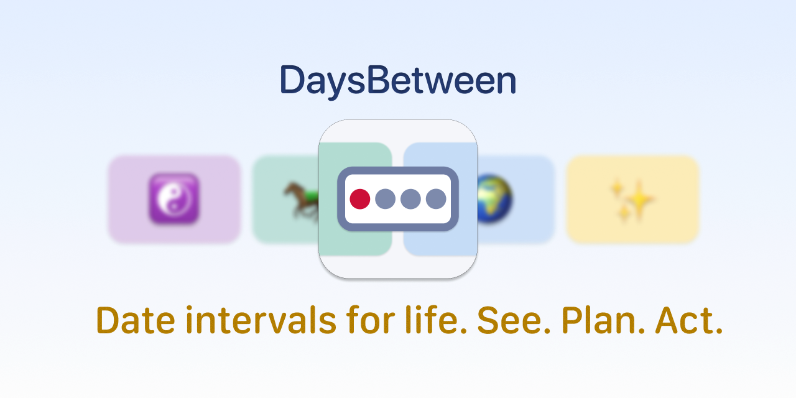
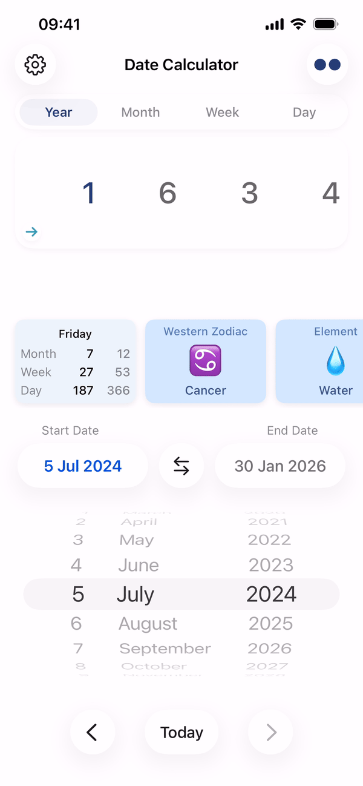
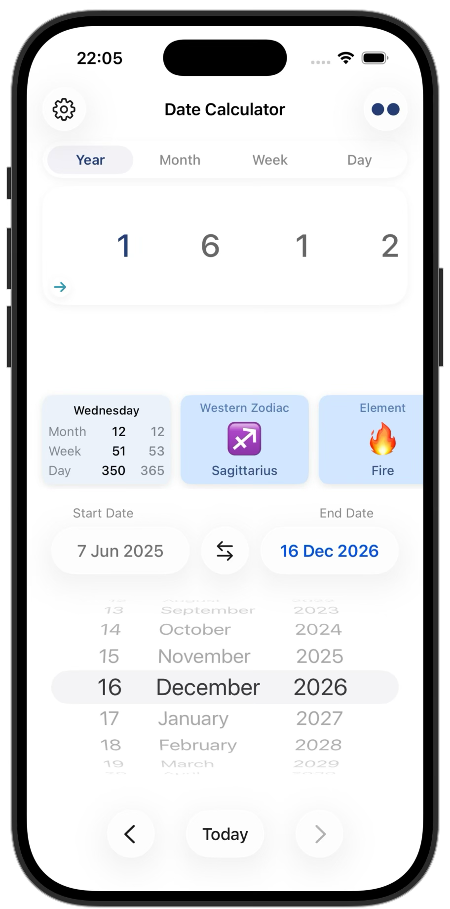
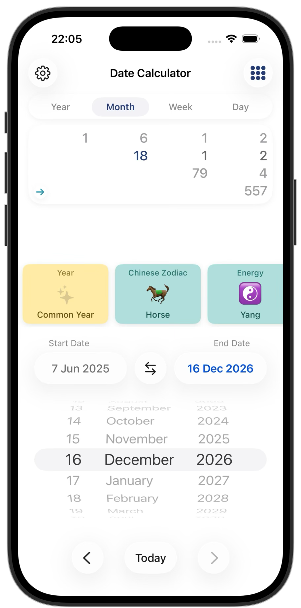
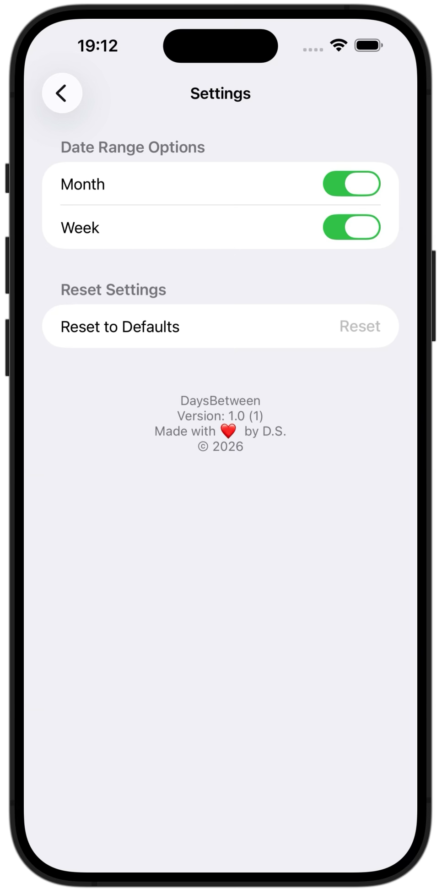

<p align="center">
  
</p>

# DaysBetween

<p align="center">
  <a href="https://apps.apple.com/us/app/daysbetween/id6758201994">
    
  </a>
</p>

DaysBetween is an iOS application for calculating time intervals between two dates, with multiple viewing modes: Year, Month, Week, and Day.
The app features a clean UI, intuitive navigation, smooth animations, and real-time interval recalculation.
Built with Swift and UIKit, following Apple’s Human Interface Guidelines.

<p align="center">
  
</p>

## Screenshots

<p align="center">
  
  
  
</p>

## Purpose

DaysBetween solves a simple but common task — calculating precise time intervals between two dates.
This project was built to practice native iOS development, refine application architecture (MVC → MVVM), and focus on clean, maintainable code.

## Features

- Two-date interval calculation
- Two view modes:
  - **Row** — focused view of the current interval
  - **Grid** — overview of all intervals
- Optional Week & Month segments
- Zodiac insights: Western & Chinese
- Clean, modern UI

## Tech Stack

- **Swift, UIKit**, fully programmatic UI (no Storyboards)
- **Auto Layout**, UIStackView
- **MVVM architecture**
- Custom UI Components
- Basic animation system

## Project Structure

```text
Controller/
    DateCalculatorViewController.swift        // Main screen: date pickers, segmented view, switching Row/Grid layouts
    SettingsTableViewController.swift         // Settings screen: toggles, layout options, footer info


Model/
    /DateCalculatorModel
        ChineseHoroscope.swift                // Logic for determining Chinese zodiac sign
        CommonTypes.swift                      // Shared enums and helper types used across the app
        DateCalculatorModel.swift              // Core business logic: date difference calculations
        InfoCards.swift                        // Predefined descriptions for horoscope & info cards
        LeapYear.swift                         // Leap-year logic and helpers
        ValuesView.swift                       // UI logic for building row/grid value displays
        WesternHoroscope.swift                 // Logic for determining Western zodiac sign

    /SettingsModel
        Settings.swift                         // Static configuration for settings screen sections & options
        SettingsModel.swift                    // Stores and manages user settings (switches, resets)


ModelView/
    DateCalculatorViewModel.swift              // Coordinates model + view, updates results and UI data


Constants/
    Colors.swift                               // App color palette (light/dark mode)
    Constants.swift                            // Shared constants


Extensions+Subclasses/
    Animational.swift                           // Helper extensions for fade/scale animations
    Calendar+Extensions.swift                   // Calendar extensions
    Date+Extensions.swift                       // Date extensions
```

## Requirements
 - **OS 16.6+**
 - Xcode 16+


## Installation

Clone the repository and open the project in Xcode:

```bash
git clone https://github.com/dsokolovdev/DaysBetween.git
cd DateCalculator
open DateCalculator.xcodeproj
```

## ❤️ Author

Created by Dmitry Sokolov  
© 2026
